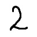
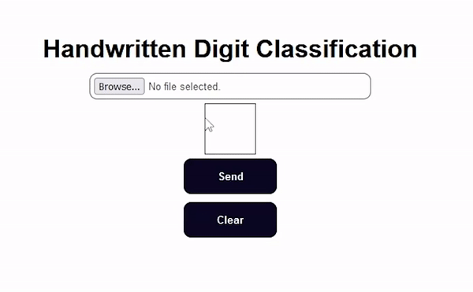
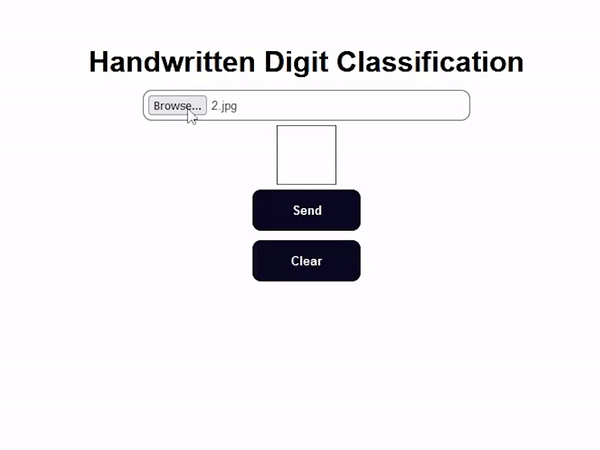

# MNIST Classification With Flask 
> Handwritten Digit Classification Web App
> 

A simple hobby project that classify drawings or images of handwritten digits using tensorflow and mnist model with ~95% accuracy. 

## Drawing

Classification of digits by drawing on canvas.

## Images

Classification using custom images of digits.

## How To Run

Create a Python Environment (Optional)
> ` pip -m venv venv `

Install Libraries 
> `pip install -r requirements.txt`
 
Start the Server
> `python server.py`

## Why?
I just created this project to learn about AI and the process behind deploying it to the web.
